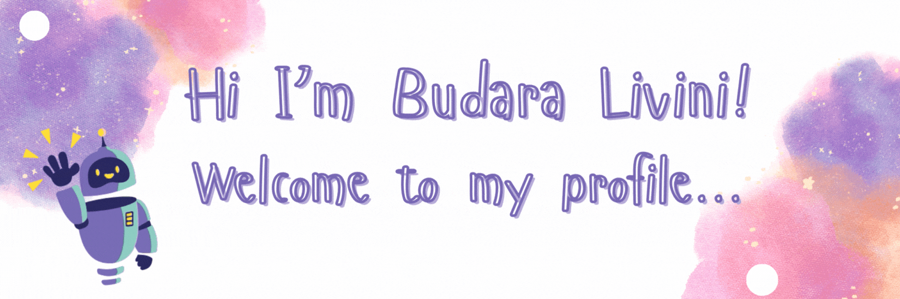

<header style="width: 100%; height: 10px;">
  
</header>

I'm a **Computer Science student** 🖥️ and a creative thinker who loves exploring new ideas and technologies. 

🌟 Here's a little more about me:

<header style="width: 100%; height: 10px;">
  
</header>

## 🌈 About Me
- 🌍 I recently moved to the **UK** and am currently staying with my aunt.
- 💼 I work as a receptionist in a **care home** while pursuing my academic passions.
- 📚 Avid reader.
- 💡 Currently building my skills in **C++**, **database systems**, and **web development**.

<header style="width: 100%; height: 10px;">
  
</header>

## 🛠️ Skills

### **Programming Languages**  
- **C++**: Currently learning object-oriented programming (OOP), data structures, and algorithms. Working on building console applications and improving understanding of functions, classes, and file handling.
- **Python**: Familiar with Python for scripting, automation, and web development. Strong foundation in libraries like `numpy`, `pandas`, and `matplotlib` for data analysis and visualization.

### **Database Management**  
- **SQL**: Still learning SQL, focusing on writing complex queries, managing databases, and understanding relational database concepts.
- **ERD Design**: Ability to design efficient entity-relationship diagrams (ERD) for clear database architecture, ensuring data integrity and proper relationship handling.

### **Web Development**  
- **HTML**: Proficient in building semantic and responsive web pages. Familiar with the latest HTML5 standards and best practices for accessibility and SEO.
- **Markdown**: Expertise in creating clean and organized documentation with Markdown, including writing professional README files for projects and GitHub repositories.

### **Creative Tools**  
- **Adobe Photoshop**: Experienced in graphic design and photo editing, creating custom visuals for web pages, presentations, and social media.
- **Canva**: Skilled in using Canva for quick and creative design work, including social media posts, infographics, and presentations.

### **Soft Skills**  
- **Problem-Solving**: Strong analytical and troubleshooting skills with a keen ability to break down complex problems into manageable tasks, leading to effective solutions.
- **Teamwork**: Collaborative team player, able to communicate and work effectively with others to achieve common goals, whether in development or creative projects.
- **Adaptability**: Comfortable in dynamic environments, willing to learn new technologies and methods to meet project requirements.
- **Time Management**: Capable of prioritizing tasks and managing multiple projects efficiently to meet deadlines while maintaining high-quality work.
- **Communication**: Clear communicator, able to explain technical concepts to both technical and non-technical audiences.
- **Empathy**: Strong emotional intelligence that enhances teamwork and user-centric development, ensuring projects align with user needs and values.

<header style="width: 100%; height: 10px;">
  
</header>

## 💻 Projects
🌟 Here are Some of My Favorite Projects So Far:

### **Eco-Footprint Companion 🌱 (Proposal)**
- **Overview**: A personalized ecological footprint calculator designed to raise awareness about environmental impact.
- **Key Features**:  
  - Calculates users' ecological footprint based on daily habits.  
  - Provides actionable suggestions to reduce environmental impact.  
  - Tracks progress over time to motivate sustainable lifestyle changes.  
- **Objective**: Educate users while making sustainability approachable and achievable.

---

### **Restaurant Takeaway Database System 🍔**
- **Overview**: A relational database system for streamlining restaurant takeaway operations.
- **Key Features**:  
  - **Entity-Relationship Diagram (ERD)**: Designed clear relationships among entities like Customers, Orders, and Menu Items.  
  - **Relational Tables**: Created efficient tables for managing complex many-to-many relationships (e.g., Ingredients and Menu Items).  
  - **Documentation**: Included detailed descriptions of database schema, relationships, and queries.  
- **Impact**: Improved restaurant management through a structured, scalable database design.

---

### **Digital Story: Volt's Renewable Energy Journey ⚡**
- **Overview**: A creative and educational digital story featuring Volt, a curious vehicle.
- **Storyline**: Volt explores an eco-friendly country, discovering various renewable energy sources like solar, wind, and hydropower.
- **Objective**: Raise awareness about renewable energy and its importance in combating climate change.
- **Key Features**:  
  - Interactive narrative format to engage readers.  
  - Highlights the significance of green energy for a sustainable future.

---

### **GitHub Portfolio 🚀**
- **Overview**: A personal portfolio hosted on GitHub to showcase my technical skills, projects, and creative endeavors.
- **Key Features**:  
  - Professionally structured README files for each project.  
  - Integration of GitHub Stats and badges to reflect contributions and languages used.  
  - Designed with an aesthetic and user-friendly layout to highlight my achievements.  
- **Repository**: [View Repository](#)

---

### **Other Notable Projects in C++**
- **Monthly Income Calculator**: Developed a program that calculates the total salary after considering allowances and deductions.
- **Coin Toss Game**: A fun interactive program that randomly generates a coin toss result and compares it with user input, adding an element of gamification.
- **Rainfall Analyzer**: A program that reads a file containing monthly rainfall data and computes the average rainfall for each month.
- **Time Converter**: A program that accepts user input for time and displays it in both 12-hour and 24-hour formats, utilizing classes, objects, and functions, while also providing a personalized greeting.
- **Average Velocity Calculator**: Designed a program that calculates the average speed based on user-defined functions, enhancing problem-solving skills in programming.
- **Isosceles Triangle Geometry**: A program that calculates the area and perimeter of an isosceles triangle using object-oriented programming concepts like classes and objects.

<header style="width: 100%; height: 10px;">
  
</header>

## 🎯 Goals for 2024
- 🌟 Master advanced C++ concepts (like classes, constructors, and objects).
- 🌍 Travel to **Switzerland** to fulfill my childhood dream.
- 💻 Build and deploy a full-stack web application.
- 📜 Expand my knowledge in **sustainable energy solutions**.

<header style="width: 100%; height: 10px;">
  
</header>

## 🎭 Who I Am
Outside of coding and tech, I'm a sensitive and emotional person who finds inspiration in the little things. Whether it's connecting with others at my care home job, crafting creative stories, or reflecting on nature, I bring heart and thoughtfulness into everything I do.

<header style="width: 100%; height: 10px;">
  
</header>

## 📫 Connect with Me
- **GitHub**: [Livini-Perera](https://github.com/Livini-Perera)
- **Email**: [budaraperera103@gmail.com](mailto:budaraperera103@gmail.com)

<header style="width: 100%; height: 10px;">
  
</header>

## 🎨 Hobbies
- 🎤 Singing
- 📖 Reading
- ✍️ Writing digital stories
- 🎨 Designing presentations and creative content

<header style="width: 100%; height: 10px;">
  
</header>

## 🏆 Stats and Badges

<header style="width: 100%; height: 10px;">
  
</header>

Thank you for stopping by! 💜 Feel free to explore my repositories and connect with me!
